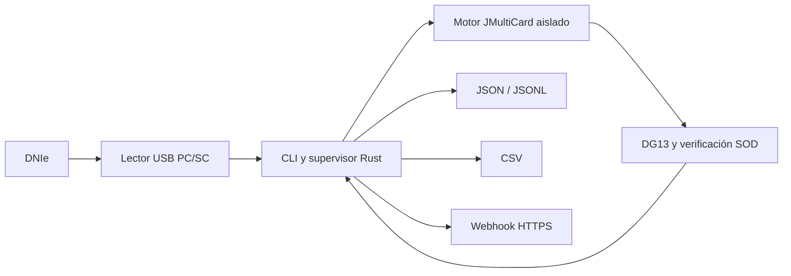

# SimpleLectorDNI

Lector de DNIe por línea de comandos para Windows y macOS. Extrae los datos textuales del chip mediante un lector USB PC/SC y los entrega como JSON, JSON Lines, CSV o webhook. No hace fotografías, no utiliza OCR y no solicita el PIN porque no firma ni accede a las claves privadas.

> Estado: beta pública. La lectura física está verificada en macOS ARM64 con DNIe 3.0 o posterior. Los paquetes de Windows y macOS Intel se compilan y prueban automáticamente, pero todavía necesitan ampliar la matriz de lectores físicos verificados.

## Inicio rápido

Descarga y descomprime el paquete de tu sistema desde [Releases](https://github.com/Balneario-de-Cofrentes/SimpleLectorDNI/releases). El paquete ya incluye el runtime mínimo de Java y el motor JMultiCard, así que no hace falta instalar Java.

La beta aún no está firmada ni notarizada. Verifica `SHA256SUMS` antes de ejecutarla. macOS o Windows pueden pedir una confirmación adicional del sistema; si la política de tu organización no permite binarios sin firma, compila desde el código fuente hasta que existan certificados de publicación.

En macOS:

```sh
./simple-lector-dni list-readers
./simple-lector-dni once --stdout
./simple-lector-dni watch --csv lecturas.csv
```

En Windows PowerShell:

```powershell
.\simple-lector-dni.exe list-readers
.\simple-lector-dni.exe once --stdout
.\simple-lector-dni.exe watch --csv lecturas.csv
```

Si hay varios lectores, selecciona uno por una parte de su nombre:

```sh
./simple-lector-dni watch --reader "Generic EMV" --jsonl lecturas.jsonl
```

## Salidas

Se pueden combinar varias salidas en una misma ejecución:

```sh
./simple-lector-dni watch \
  --json ultimo.dni.json \
  --jsonl historial.jsonl \
  --csv historial.csv \
  --webhook https://pms.example.com/check-in/dni
```

- `--stdout`: un JSON por lectura en la salida estándar.
- `--json RUTA`: sustituye atómicamente el último registro.
- `--jsonl RUTA`: añade un registro JSON por línea.
- `--csv RUTA`: añade una fila con fecha, hora y datos del documento.
- `--webhook URL`: hace `POST` del mismo registro JSON.

Sin una salida explícita se usa `--stdout`. Los ficheros creados son privados para el usuario del proceso en sistemas Unix. El CSV neutraliza valores que una hoja de cálculo podría interpretar como fórmulas.

## Comportamiento pensado para recepción

El modo `watch` se mantiene activo y:

1. Detecta lector, inserción y retirada mediante PC/SC.
2. Lee una sola vez por inserción.
3. Reintenta errores recuperables hasta tres veces.
4. Espera a que se retire el DNI antes de aceptar otra lectura.
5. Se recupera si se desconecta y vuelve a conectar el lector.

## Qué datos puede obtener

El chip expone en DG13 nombre, apellidos, DNI, fechas de nacimiento y caducidad, nacionalidad, número de soporte, sexo, lugar de nacimiento, nombres de progenitores, dirección, localidad, provincia, país, versión del DNIe y número de serie del chip. La disponibilidad concreta depende de la versión y del contenido del documento.

SimpleLectorDNI valida la firma del SOD y el hash de DG13. No solicita ni lee DG2 (fotografía) ni DG7 (firma manuscrita), y no implementa firma electrónica.

## Arquitectura



Rust se ocupa del ciclo del lector, reintentos, salidas y proceso principal. Un worker Java pequeño y reemplazable contiene únicamente la integración criptográfica con la librería oficial JMultiCard. Consulta la [investigación técnica](docs/RESEARCH.md) y el [contrato de integración](docs/INTEGRATION.md).

## Privacidad y límites

Los datos del DNI son datos personales. El programa procesa localmente y no envía nada salvo que configures un webhook. Quien lo integre debe definir base jurídica, información al huésped, minimización, controles de acceso y borrado. Consulta la [guía de privacidad](docs/PRIVACY.md).

Un lector profesional puede incluir sensores ópticos, UV o IR, OCR, lectura de pasaportes y controles antifraude. Este proyecto sustituye únicamente la extracción de datos textuales accesibles desde el chip DNIe con un lector PC/SC compatible.

## Desarrollo

```sh
git clone --recurse-submodules https://github.com/Balneario-de-Cofrentes/SimpleLectorDNI.git
cd SimpleLectorDNI
cargo test --workspace --locked
scripts/build-worker.sh
```

Consulta [CONTRIBUTING.md](CONTRIBUTING.md), la [compatibilidad](docs/COMPATIBILITY.md) y las [pruebas manuales](docs/MANUAL_TESTS.md).

## Licencia

SimpleLectorDNI se publica bajo EUPL-1.2. JMultiCard y el resto de dependencias conservan sus licencias y avisos, detallados en [THIRD_PARTY_NOTICES.md](THIRD_PARTY_NOTICES.md), [THIRD_PARTY_LICENSES.md](THIRD_PARTY_LICENSES.md) y el [expediente completo generado](THIRD_PARTY_LICENSES.html).
