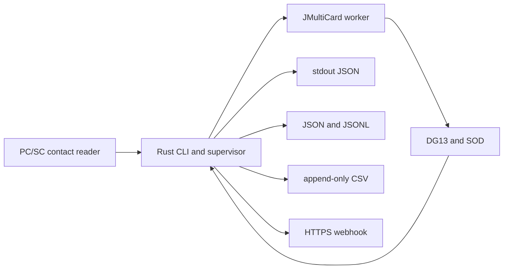
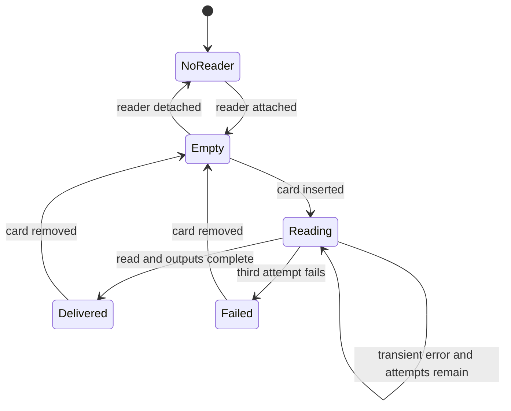

# SimpleLectorDNI Design

**Date:** 2026-09-04

**Status:** Approved

## Product goal

SimpleLectorDNI is a public, scriptable command-line tool for hotels and other authorised operators to read the textual identity data stored in the DG13 data group of a Spanish DNIe through a standard contact smart-card reader. It avoids photography and OCR, does not sign, never requests the PIN, and does not extract the portrait or handwritten signature.

The initial release targets Windows x64, macOS Intel, and macOS Apple Silicon. Each release is a self-contained ZIP and does not require Java, Maven, Rust, or another development tool to be installed.

## Architecture

The public command is a Rust binary. Rust owns the long-running process, reader and card event detection, retries, output delivery, diagnostics, and the stable public data contract.

The cryptographic DNIe operation is isolated behind a versioned JSON protocol. Version 1 uses a small Java worker backed by the official JMultiCard project. The release bundle includes a minimal Java runtime, so Java is an internal implementation detail rather than a user requirement. A future native Rust worker can implement the same protocol without changing the CLI or integrations.

## Commands

- `simple-lector-dni once` waits for one card, reads it, delivers all configured outputs, and exits.
- `simple-lector-dni watch` monitors readers continuously and emits one record for every insertion cycle.
- `simple-lector-dni list-readers` lists the PC/SC readers currently visible to the operating system.

The first compatible reader is used by default. `--reader <substring>` selects a reader explicitly.

## Card lifecycle

A card is read only once while it remains inserted. Each retry creates a fresh engine process and a fresh PC/SC session. After three failed attempts, the program waits for removal instead of repeatedly accessing the card. Removal followed by insertion starts a new cycle. Reader attachment and detachment are recoverable events in `watch` mode.

## Outputs and failure isolation

Every successful read produces one logical `ReadRecord`. Configured sinks consume the same immutable record:

- stdout emits one JSON object.
- `--json <path>` atomically replaces the latest-record file.
- `--jsonl <path>` appends one JSON object per line.
- `--csv <path>` creates a header once and appends one protected row per read.
- `--webhook <https-url>` posts the record as JSON.

One sink failure does not prevent the others from running. The command exits unsuccessfully in `once` mode if any configured sink fails. In `watch` mode it reports the sink failure without exposing identity values and continues monitoring.

Webhook authentication is read from `SIMPLE_LECTOR_DNI_WEBHOOK_TOKEN`. The token never appears in command-line arguments or logs. Webhooks require HTTPS except for loopback addresses. Requests include `Idempotency-Key` with the read identifier and a bounded timeout.

## Public schema

The envelope contains:

- `schema_version`, initially `1`.
- `read_id`, a UUID generated once per successful insertion cycle.
- `read_at`, an RFC 3339 timestamp including an offset.
- `reader`, the PC/SC reader name.
- `source`, fixed to `DNIe_DG13`.
- `integrity`, with the DG13/SOD verification result.
- `document`, containing the textual fields returned by DG13 plus technical version and chip serial when available.

Optional or unavailable document fields are represented as empty strings in version 1 to keep CSV columns stable.

## Privacy and security

- The worker reads DG13 and the minimum technical files required for its secure channel.
- It must not read DG2 or DG7, which contain portrait and handwritten-signature images.
- SOD verification checks the signature and DG13 hash only.
- Errors and diagnostics never contain document field values or raw APDUs.
- Output files are private to the current account where the operating system supports permissions.
- CSV cells beginning with formula control characters are escaped before writing.
- Tests and examples use synthetic identities only.
- Generated identity files and local prototypes are ignored by Git.

Operators remain responsible for lawful purpose, information duties, retention, access control, and all other applicable data-protection obligations.

## Compatibility and release policy

Version 1 supports Spanish DNIe contact cards compatible with JMultiCard's DNIe 3/4 flow. It does not claim support for passports, TIE, documents without a compatible chip, NFC readers, OCR, ultraviolet or infrared inspection, or physical-document fraud detection.

JMultiCard is pinned to a reviewed upstream version. The release remains beta until several DNIe generations and readers have been tested on both supported operating systems. The repository documents verified combinations and known failures.

The project uses the EUPL-1.2 license, compatible with the EUPL option declared by JMultiCard's source headers. Third-party notices preserve upstream licensing and attribution.
